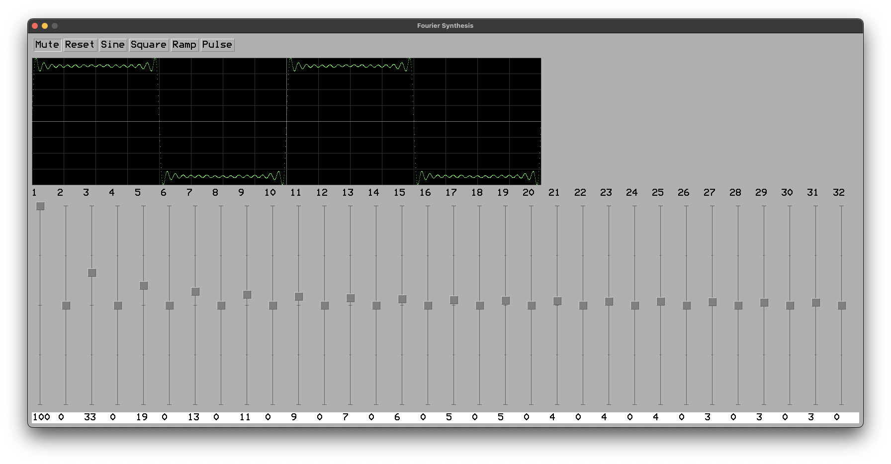

# Additive

A demonstration of additive synthesis.

GUI or MIDI control of 32 harmonics with "oscilloscope" view of the waveform and audio out with a 440 Hz fundamental.

## Dependencies

+ https://github.com/AnotherJohnH/Platform  (pulled in at checkout)
+ SDL2
+ cmake and UNIX make or auto detection of ninja if installed

## Checkout

This repo uses git sub-modules, so checkout using --recurse to clone all the
dependent source...

    git clone --recurse https://github.com/AnotherJohnH/Additive.git

or

    git clone --recurse ssh://git@github.com/AnotherJohnH/Additive.git

## Build

Developed on MacOS but should build on Linux too. Indirect build with
`cmake` and `make` or `ninja`...

    make

Direct build using `cmake` and `make`...

    mkdir build
    cd build
    cmake ..
    make

## Run

After a build binary will be found here `buid/native/additive`. Command line interface...

    NAME
         Additive - Demonstrate additive synthesis

    SYNOPSIS
         additive [options]

    OPTIONS
         -v,--version             Display version information
         -h,--help                Display this help
